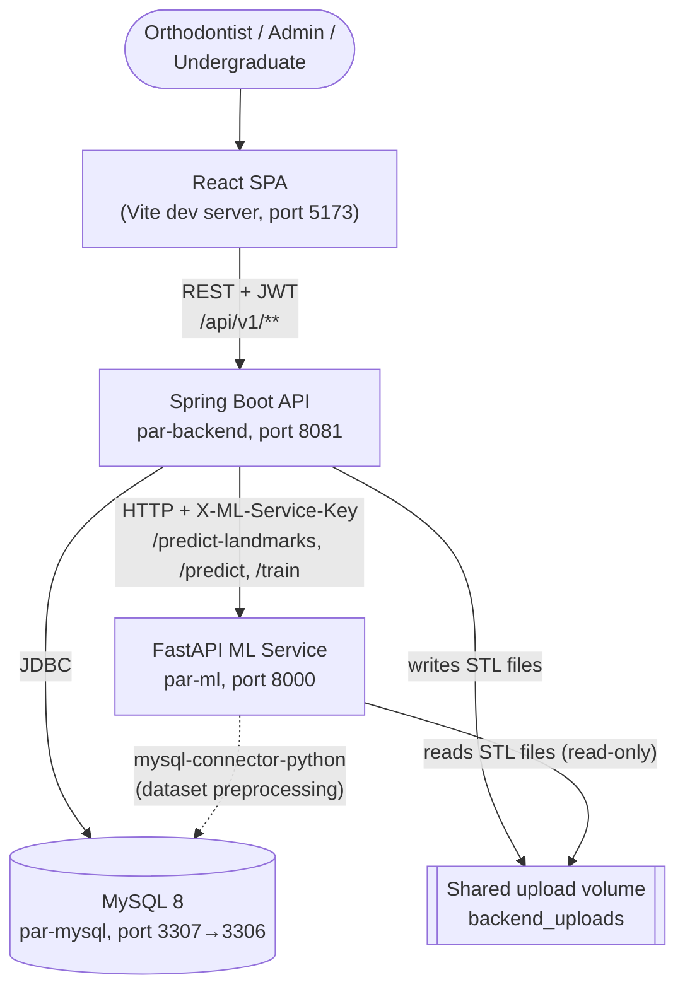
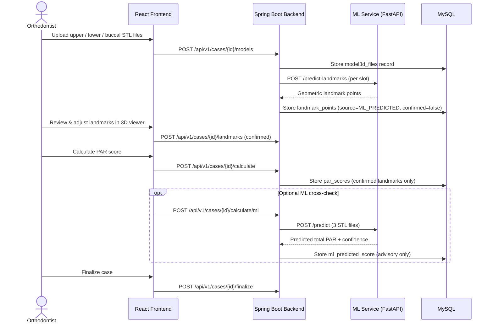
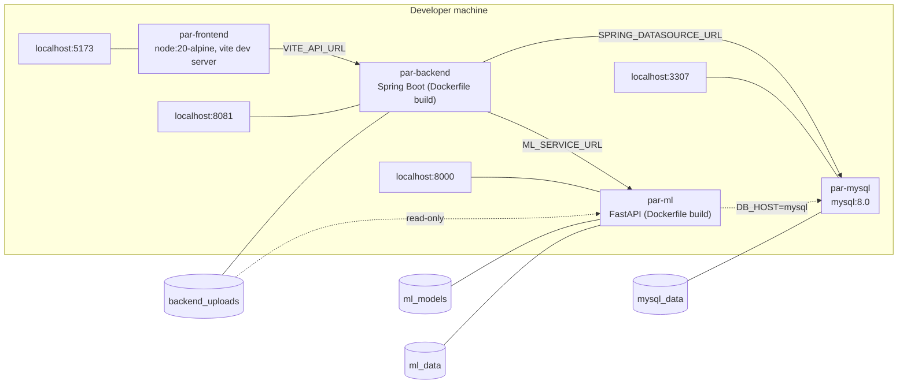
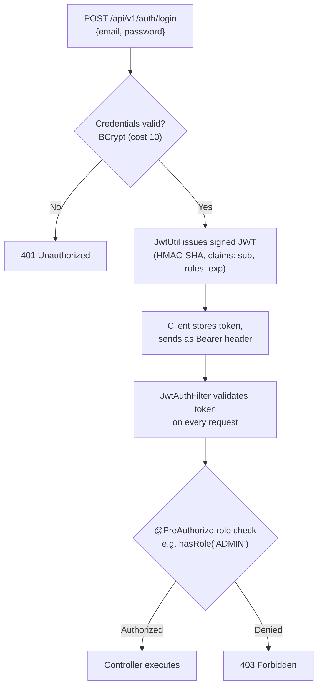
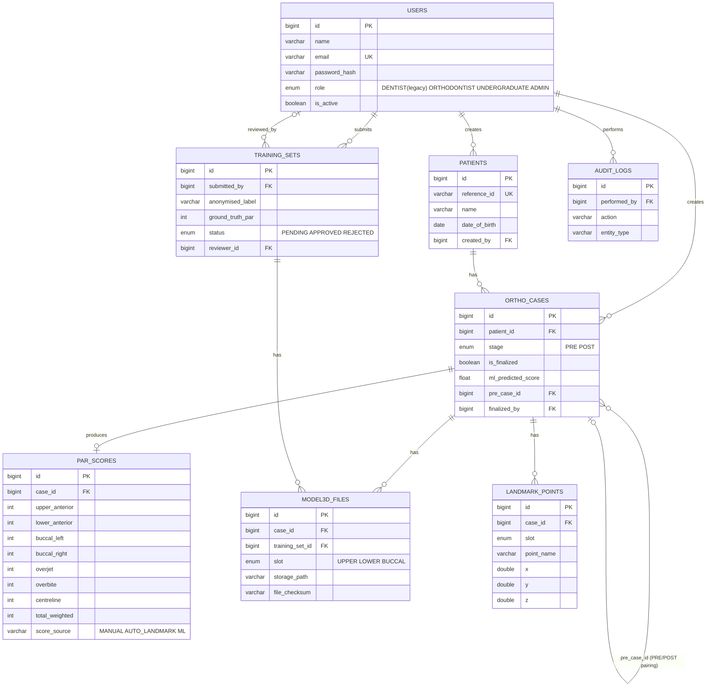

<div align="center">

# 🦷 Web-Based PAR Index System

**A clinical decision-support platform for automated orthodontic PAR scoring from 3D dental scans.**

<br/>

[](#technology-stack)
[](#technology-stack)
[](#technology-stack)
[](#technology-stack)
[](#technology-stack)
[](#technology-stack)
[](#technology-stack)

<br/>

[](#academic-context)
[](#academic-context)
[](#academic-context)

</div>

---

## Academic Context

<div align="center">

| 🏛️ University | 🏢 Faculty | 📘 Course | 📦 Repository |
|:---:|:---:|:---:|:---:|
| University of Peradeniya | Faculty of Engineering | CO2060 — Web-Based Software Development | `e22-co2060-Web_Based_PAR_Index_System` |

</div>

---

## Table of Contents

- [Overview](#overview)
- [System Architecture](#system-architecture)
- [Key Features](#key-features)
- [Technology Stack](#technology-stack)
- [Repository Structure](#repository-structure)
- [User Roles](#user-roles)
- [Clinical Workflow](#clinical-workflow)
- [Installation & Setup](#installation--setup)
- [Accessing the Application](#accessing-the-application)
- [Database](#database)
- [API Reference](#api-reference)
- [Machine Learning Service](#machine-learning-service)
- [PAR Score Calculation](#par-score-calculation)
- [Security](#security)
- [Development Workflow](#development-workflow)
- [Troubleshooting](#troubleshooting)

---

<a id="overview"></a>
## 📖 Overview

The **PAR Index** (Peer Assessment Rating) is a clinical scoring system orthodontists use to measure how well a patient's teeth are aligned, before and after treatment. Scoring is normally done by hand from physical or scanned dental models — a slow process that varies from one clinician to another.

This system digitises that workflow. An orthodontist uploads intraoral 3D scans (STL meshes) of a patient's upper arch, lower arch, and buccal (bite) view, places or reviews clinical landmark points on them, and the application calculates the weighted PAR score automatically from those landmarks. A machine-learning service assists by geometrically proposing landmark positions and by independently predicting a total PAR score directly from mesh geometry, which the clinician can use as a cross-check — it never replaces the clinician-confirmed geometric score.

The project also includes a data-collection pipeline: undergraduate students submit anonymised scan sets with a ground-truth PAR score, orthodontists review and approve them, and approved submissions build the labelled dataset the ML model is retrained on.

### Core Components

| | Component | Role |
|:---:|---|---|
| 🖥️ | **React SPA** | Patients, cases, 3D landmark placement, and administration UI |
| ☕ | **Spring Boot API** | Owns all clinical data, authentication, and business rules |
| 🧠 | **FastAPI ML Service** | Geometric landmark detection and PAR regression |
| 🗄️ | **MySQL Database** | Schema-managed by Flyway migrations |

---

<a id="system-architecture"></a>
## 🏗️ System Architecture



The frontend never talks to the ML service directly — every ML call is proxied and authorised through the Spring Boot backend, which injects the shared `X-ML-Service-Key` secret. The ML service reaches the same uploaded mesh files as the backend through a shared, read-only Docker volume rather than having files re-uploaded to it.

### Clinical Data Flow



### Deployment Architecture (Docker Compose)



`par-ml` waits on `mysql`'s healthcheck, and `par-backend` waits on both `mysql` and `par-ml` being healthy before it starts, per `docker-compose.yml`.

> **Note:** `frontend/Dockerfile` and `frontend/nginx.conf` exist in the repository (a production Nginx build), but the checked-in `docker-compose.yml` currently runs the frontend as a live Vite **dev server** (`npm run dev`) rather than building that image — worth knowing if you expect a production-style container.

### Authentication Flow



Sessions are fully **stateless** — Spring Security is configured with `SessionCreationPolicy.STATELESS`, and every request is re-authenticated from its JWT.

---

<a id="key-features"></a>
## ✨ Key Features

<table>
<tr>
<td width="50%" valign="top">

#### 👤 User Management
- Email/password registration and login with JWT-based sessions
- Role-based access control enforced at the URL level (`SecurityConfig`) and method level (`@PreAuthorize`)
- Administrator accounts are **pre-seeded only** — the public `/register` endpoint explicitly rejects requests for the `ADMIN` role

#### 🗂️ Patient & Case Management
- Create, search, and manage patient records
- Cases track a `PRE`/`POST` treatment stage and can be linked to a paired pre-treatment case (`pre_case_id`)
- Cases can be **finalized** (locked) by the treating orthodontist; only an admin can unfinalize one

#### 🦷 3D Model & Landmark Workflow
- Upload upper, lower, and buccal STL scans per case (Three.js-based in-browser 3D viewer)
- Automatic geometric landmark proposal via the ML service, reviewed and confirmed by the orthodontist
- Only **confirmed** landmarks feed into the PAR calculation — unconfirmed ML predictions never affect a clinical score

</td>
<td width="50%" valign="top">

#### 🧮 PAR Score Calculation
- Implements the weighted British-standard PAR index (see [PAR Score Calculation](#par-score-calculation))
- Each score records its `score_source` — `MANUAL`, `AUTO_LANDMARK`, or `ML` — so it's always clear how a number was derived

#### 🤖 AI/ML-Assisted Features
- Geometric landmark detection from raw mesh surfaces — no manual annotation needed for a starting proposal
- A trained PyTorch regression model gives an independent total-PAR estimate as an advisory cross-check
- Admin-triggered model training and versioned rollback

#### 🎓 Training Data Pipeline
- Undergraduates submit anonymised scan sets with a ground-truth PAR score
- Orthodontists review and approve/reject submissions before they enter the training dataset
- A dataset preprocessor converts approved submissions into tensors for retraining

#### 🛡️ Administration
- User management and audit log review (`ADMIN` only)
- ML model metrics, training runs, and rollback control
- Every PAR calculation, ML prediction, and finalize/unfinalize action is written to an audit trail

</td>
</tr>
</table>

---

<a id="technology-stack"></a>
## 🧰 Technology Stack

| Layer | Technology |
|---|---|
| Frontend | React 19, Vite, React Router 7, Three.js (STL rendering, 3D viewer), Recharts, Axios |
| Backend | Spring Boot 3, Spring Security, Spring Data JPA / Hibernate, Flyway |
| Authentication | JWT (`jjwt`), stateless sessions, BCrypt password hashing |
| ML Service | Python 3.11, FastAPI, Uvicorn, PyTorch (CPU build), trimesh, NetworkX, NumPy, SciPy, slowapi (rate limiting) |
| Database | MySQL 8.0 |
| Containerization | Docker Compose |
| API Docs | springdoc-openapi (Swagger UI) |

---

<a id="repository-structure"></a>
## 📂 Repository Structure

```text
e22-co2060-Web_Based_PAR_Index_System/
├── README.md
├── clinical_feedback_form.pdf          # Dentist feedback collected during development
├── clinical_feedback_2nd_phase.pdf
├── docs/                               # GitHub Pages project docs site
└── code/
    ├── docker-compose.yml              # Orchestrates all four services
    ├── database/
    │   ├── init.sql                    # Creates par_system DB + app DB user
    │   ├── schema.sql                  # Full schema (mirrors Flyway migrations)
    │   └── data.sql                    # Reference/sample data
    ├── backend/                        # Spring Boot REST API
    │   ├── Dockerfile
    │   └── src/main/java/com/parsystem/
    │       ├── controller/             # REST endpoints (auth, cases, patients, ML, training sets...)
    │       ├── service/                # Business logic (PAR calc, ML client, landmarks...)
    │       ├── entity/                 # JPA entities
    │       ├── repository/             # Spring Data repositories
    │       ├── security/               # JWT filter & utilities
    │       ├── config/                 # Security, admin seed, REST client config
    │       ├── dto/                    # Request/response payloads
    │       └── resources/db/migration/ # Flyway migrations V2–V8
    ├── ml_service/                     # FastAPI ML microservice
    │   ├── Dockerfile
    │   ├── app/
    │   │   ├── main.py                 # API routes
    │   │   └── core/
    │   │       ├── landmark_detector.py
    │   │       ├── model_store.py      # Model load/train/rollback
    │   │       └── config.py
    │   └── dataset_preprocessor.py     # Builds training tensors from approved submissions
    └── frontend/                       # React SPA
        ├── Dockerfile                  # Nginx production build (not used by docker-compose.yml)
        ├── nginx.conf
        └── src/
            ├── pages/                  # Dashboard, CaseDetail, PatientList, AdminPanel, Training*
            ├── components/             # STLViewer, Model3DViewer, LandmarkPanel, MLStatusPanel...
            ├── api/
            └── context/
```

---

<a id="user-roles"></a>
## 🔑 User Roles

| Role | Description |
|---|---|
| **ADMIN** | Full system access: user management, ML training control and rollback, audit log review, unfinalizing cases. Cannot be created through public registration. |
| **ORTHODONTIST** | Clinical user. Creates patients and cases, uploads 3D models, reviews/confirms landmarks, calculates and finalizes PAR scores, reviews undergraduate training submissions. |
| **UNDERGRADUATE** | Submits anonymised 3D scan sets with a ground-truth PAR score for the ML training dataset. |

> The `users.role` column also defines a legacy `DENTIST` value in the schema, but the registration service explicitly rejects it ("DENTIST role is no longer supported. Use ORTHODONTIST instead."), so only the three roles above are usable in practice.

---

<a id="clinical-workflow"></a>
## 🩺 Clinical Workflow

1. **Patient intake** — an orthodontist creates a patient record.
2. **Case creation** — a `PRE` or `POST` treatment case is opened for that patient.
3. **Model upload** — upper, lower, and buccal STL scans are uploaded for the case.
4. **Landmark proposal** — the backend asks the ML service to geometrically propose landmark points per arch.
5. **Clinical review** — the orthodontist reviews the proposed points in the 3D viewer, adjusts as needed, and confirms them.
6. **PAR calculation** — the backend computes the weighted PAR score from confirmed landmarks only.
7. **Optional ML cross-check** — an independent total-PAR estimate can be requested from the trained regression model as an advisory figure.
8. **Finalization** — the orthodontist finalizes the case, locking it; only an admin can reopen it.

---

<a id="installation--setup"></a>
## ⚙️ Installation & Setup

### Prerequisites

| Tool | Required for |
|---|---|
| Git | Cloning the repository |
| Docker + Docker Compose | Running the full stack (recommended) |
| Java 17 | Backend, if running outside Docker |
| Node.js 20 | Frontend, if running outside Docker |
| Python 3.11 | ML service, if running outside Docker |
| MySQL 8.0 | Database, if running outside Docker |

### 1. Clone the repository

```bash
git clone https://github.com/cepdnaclk/e22-co2060-Web_Based_PAR_Index_System.git
cd e22-co2060-Web_Based_PAR_Index_System/code
```

### 2. Configure environment variables

The repository does **not** commit a `.env` file (correctly — MySQL and JWT credentials must never be committed). Create one yourself in `code/`:

```env
# code/.env
DB_PASSWORD=<choose a strong MySQL root password>
JWT_SECRET=<base64 string, decodes to at least 32 bytes — e.g. `openssl rand -base64 32`>
ML_SERVICE_SECRET=<a separate random secret shared between backend and ML service>
```

| Variable | Used by | Purpose |
|---|---|---|
| `DB_PASSWORD` | mysql, par-backend, par-ml | MySQL root password (mysql), datasource credential (backend, ml preprocessor) |
| `JWT_SECRET` | par-backend | Signs/verifies JWTs (`app.jwt.secret`); must Base64-decode to ≥32 bytes |
| `ML_SERVICE_SECRET` | par-backend, par-ml | Shared secret sent as the `X-ML-Service-Key` header on every backend→ML call |

> `database/init.sql` also creates a secondary `paruser` MySQL account with a password hardcoded in that file. Treat that value as compromised in any real deployment and rotate it — do not reuse it.

### 3. Start the stack with Docker Compose

```bash
docker compose up --build
```

This builds and starts, in dependency order: `par-mysql` → `par-ml` → `par-backend` → `par-frontend`.

### 4. Local development without Docker (per service)

**Backend**
```bash
cd backend
export DB_PASSWORD=... JWT_SECRET=... ML_SERVICE_URL=http://localhost:8000 ML_SERVICE_SECRET=...
mvn spring-boot:run
```

**ML service**
```bash
cd ml_service
python -m venv venv && source venv/bin/activate   # Windows: venv\Scripts\activate
pip install -r requirements.txt
uvicorn app.main:app --host 127.0.0.1 --port 8000 --reload
```

**Frontend**
```bash
cd frontend
npm install
npm run dev -- --host
```

---

<a id="accessing-the-application"></a>
## 🌐 Accessing the Application

| Service | URL | Notes |
|---|---|---|
| Frontend | http://localhost:5173 | Vite dev server |
| Backend API | http://localhost:8081/api/v1 | Spring Boot |
| Swagger / OpenAPI UI | http://localhost:8081/swagger-ui.html | Public, no auth |
| ML Service | http://localhost:8000 | Internal — requires `X-ML-Service-Key`; not meant to be called by the browser directly |
| MySQL | localhost:3307 (maps to container port 3306) | `par_system` database |

---

<a id="database"></a>
## 🗄️ Database

MySQL 8.0, schema-versioned with **Flyway** (`V2`–`V8` under `backend/src/main/resources/db/migration`; `database/schema.sql` mirrors the same structure for manual setup).

### Core Entities



### Initialization

`database/init.sql` creates the `par_system` database (mounted automatically by the `mysql` container on first boot). Flyway then applies `V2`–`V8` on backend startup (`spring.flyway.enabled: true`), including the two pre-seeded admin accounts (`V4__seed_admin_accounts.sql`). For a fully manual (non-Docker) setup:

```bash
mysql -u root -p par_system < database/schema.sql
mysql -u root -p par_system < database/data.sql
```

---

<a id="api-reference"></a>
## 📡 API Reference

Full interactive documentation is available at `/swagger-ui.html` once the backend is running. Base path: `/api/v1`.

<details open>
<summary><strong>🔓 Authentication</strong> <em>(public)</em></summary>
<br/>

| Method | Endpoint | Description |
|:---:|---|---|
| `POST` | `/auth/register` | Register a new user (`ADMIN` and `DENTIST` roles are rejected) |
| `POST` | `/auth/login` | Authenticate and receive a JWT |

</details>

<details>
<summary><strong>👤 Users & Admin</strong></summary>
<br/>

| Method | Endpoint | Description | Access |
|:---:|---|---|---|
| `GET` | `/me` | Current authenticated user | Any authenticated user |
| `GET` | `/admin/users` | List/manage users | `ADMIN` |
| `GET` | `/admin/audit` | View audit log | `ADMIN` |

</details>

<details>
<summary><strong>🧑‍⚕️ Patients</strong></summary>
<br/>

| Method | Endpoint | Description | Access |
|:---:|---|---|---|
| `GET` | `/patients` | List patients | `ORTHODONTIST`, `ADMIN` |
| `GET` | `/patients/{id}` | Patient detail | `ORTHODONTIST`, `ADMIN` |
| `GET` | `/patients/search` | Search patients | `ORTHODONTIST`, `ADMIN` |
| `POST` | `/patients` | Create patient | `ORTHODONTIST` |
| `PUT` | `/patients/{id}` | Update patient | `ORTHODONTIST` |

</details>

<details>
<summary><strong>📋 Cases</strong></summary>
<br/>

| Method | Endpoint | Description | Access |
|:---:|---|---|---|
| `POST` | `/cases` | Create a case | `ORTHODONTIST` |
| `GET` | `/cases/patient/{patientId}` | Cases for a patient | `ORTHODONTIST`, `ADMIN` |
| `GET` | `/cases/{id}` | Case detail | `ORTHODONTIST`, `ADMIN` |
| `POST` | `/cases/{id}/models` | Upload STL model for a slot | `ORTHODONTIST` |
| `GET` | `/cases/{id}/models/{slot}` | Fetch model metadata | `ORTHODONTIST`, `ADMIN` |
| `GET` | `/cases/{id}/models/{slot}/verify` | Verify a model's checksum | `ORTHODONTIST`, `ADMIN` |
| `POST` | `/cases/{id}/calculate` | Calculate PAR from confirmed landmarks | `ORTHODONTIST` |
| `POST` | `/cases/{id}/calculate/ml` | Request an ML total-PAR estimate | `ORTHODONTIST` |
| `POST` | `/cases/{id}/finalize` | Lock the case | `ORTHODONTIST` |
| `PUT` | `/cases/{id}/unfinalize` | Reopen a finalized case | `ADMIN` |

</details>

<details>
<summary><strong>📍 Landmarks & Files</strong></summary>
<br/>

| Method | Endpoint | Description | Access |
|:---:|---|---|---|
| `POST` | `/cases/{id}/landmarks` | Save confirmed landmark points | `ORTHODONTIST`, `ADMIN` |
| `GET` | `/cases/{id}/landmarks` | Fetch landmark points | `ORTHODONTIST`, `ADMIN` |
| `DELETE` | `/cases/{id}/landmarks` | Delete landmark points | `ORTHODONTIST`, `ADMIN` |
| `POST` | `/cases/{id}/predict-landmarks` | Request ML geometric landmark proposal | `ORTHODONTIST`, `ADMIN` |
| `POST` | `/cases/{id}/auto-calculate` | Auto-calculate PAR from proposed landmarks | `ORTHODONTIST`, `ADMIN` |
| `GET` | `/cases/files/{fileId}` | Download an uploaded STL file | `ORTHODONTIST`, `ADMIN` |

</details>

<details>
<summary><strong>🤖 ML Administration</strong></summary>
<br/>

| Method | Endpoint | Description | Access |
|:---:|---|---|---|
| `GET` | `/ml/status` | Current model status | `UNDERGRADUATE`, `ORTHODONTIST`, `ADMIN` |
| `GET` | `/ml/metrics` | Training run metrics | `UNDERGRADUATE`, `ADMIN` |
| `GET` | `/ml/my-runs` | Training runs submitted by the caller | `UNDERGRADUATE`, `ADMIN` |
| `POST` | `/ml/train` | Start a training run | `UNDERGRADUATE`, `ADMIN` |
| `POST` | `/ml/rollback/{version}` | Roll back to a prior model version | `ADMIN` |
| `GET` | `/ml/admin/audit-logs` | ML-related audit entries | `ADMIN` |

</details>

<details>
<summary><strong>🎓 Training Data Submissions</strong></summary>
<br/>

| Method | Endpoint | Description | Access |
|:---:|---|---|---|
| `POST` | `/training-sets` | Submit an anonymised scan set | `UNDERGRADUATE`, `ADMIN` |
| `POST` | `/training-sets/{id}/models` | Upload models for a submission | `UNDERGRADUATE`, `ADMIN` |
| `GET` | `/training-sets/my` | Submissions by the caller | `UNDERGRADUATE`, `ADMIN` |
| `GET` | `/training-sets/assigned` | Submissions assigned for review | `ORTHODONTIST`, `ADMIN` |
| `PUT` | `/training-sets/{id}/review` | Approve/reject a submission | `ORTHODONTIST`, `ADMIN` |
| `DELETE` | `/training-sets/{id}` | Delete a submission | `UNDERGRADUATE`, `ADMIN` |

</details>

---

<a id="machine-learning-service"></a>
## 🤖 Machine Learning Service

A standalone **FastAPI** service (`ml_service/`) that never talks directly to the frontend — every call is proxied through the Spring Boot backend and authenticated with a shared `X-ML-Service-Key` header (enforced for every route except `/health`, `/docs`, `/openapi.json`, `/redoc`).

| Endpoint | Purpose |
|---|---|
| `GET /health` | Liveness check (also used by the Docker healthcheck) |
| `GET /status` | Current loaded model version, accuracy, dataset size |
| `POST /predict` | Total-PAR prediction from 3 STL meshes (upper, lower, buccal). Rate-limited to 10 calls/minute |
| `POST /predict-landmarks` | Geometric landmark-point detection for a single arch/slot |
| `POST /predict-par` | Two-mesh PAR estimate — **intentionally returns 503**, since the trained model requires all three meshes and the backend already treats this as a best-effort call |
| `POST /train` | Trains a new PARRegressor model version and backs up the previous one |
| `POST /rollback/{version}` | Restores a previously backed-up model version |

**Two distinct ML capabilities:**
1. **Geometric landmark detection** (`landmark_detector.py`) — a rule-based/geometric method (curvature and mesh-surface analysis via `trimesh`/`networkx`), not a trained model. It gives orthodontists a starting point for landmark placement; every point must still be reviewed and confirmed.
2. **PAR regression model** (`model_store.py`) — a PyTorch (CPU) regression model trained on approved training-set submissions, producing an advisory total-PAR estimate with a confidence value. It is never used as the clinical score by itself.

`dataset_preprocessor.py` reads **APPROVED** training-set submissions from MySQL and builds the tensor dataset used for training.

---

<a id="par-score-calculation"></a>
## 🧮 PAR Score Calculation

The system implements the weighted PAR index (`GeometricPARService`, weights defined on the `PARScore` entity):

| Component | Weight |
|---|---|
| Upper anterior | × 1 |
| Lower anterior | × 1 |
| Buccal left | × 1 |
| Buccal right | × 1 |
| Overjet | × 6 |
| Overbite | × 2 |
| Centreline | × 4 |

The weighted total is computed only from **confirmed** clinical landmarks — ML-proposed but unconfirmed points cannot influence the stored score. Each stored score records a `score_source` of `MANUAL`, `AUTO_LANDMARK`, or `ML` so it's traceable how the number was produced.

---

<a id="security"></a>
## 🔒 Security

| Mechanism | Details |
|---|---|
| Authentication | Stateless JWT (HMAC-signed, `app.jwt.secret` must decode to ≥32 bytes), 24-hour default expiry |
| Password storage | BCrypt, cost factor 10 |
| Authorization | Spring Security URL rules + method-level `@PreAuthorize` role checks on nearly every endpoint |
| Admin provisioning | Admin accounts are pre-seeded via a Flyway migration only; public registration cannot create `ADMIN` (or the deprecated `DENTIST`) accounts |
| Service-to-service auth | Every backend→ML call carries a shared `X-ML-Service-Key` header, validated by FastAPI middleware |
| CORS | Restricted to `http://localhost:5173` and `http://localhost:3000` |
| Rate limiting | ML `/predict` limited to 10 requests/minute (`slowapi`) |
| File access | STL downloads restricted to `ORTHODONTIST`/`ADMIN`; the ML service's uploads volume is mounted **read-only** |
| Auditing | Login, registration, PAR calculation, ML predictions, and case finalize/unfinalize actions are written to `audit_logs` |

> `database/init.sql` contains a hardcoded MySQL password for a secondary `paruser` account. Rotate this before any real deployment — do not treat it as a safe default.

---

<a id="development-workflow"></a>
## 🛠️ Development Workflow

**Rebuild a single service after code changes**
```bash
docker compose build par-backend
docker compose up -d par-backend
```

**View logs**
```bash
docker compose logs -f              # all services
docker logs -f par-backend
docker logs -f par-ml
docker logs -f par-frontend
```

**Check service status**
```bash
docker compose ps
```

**Full clean rebuild**
```bash
docker compose down
docker compose build --no-cache
docker compose up -d
```

**Access the database directly**
```bash
docker exec -it par-mysql mysql -u root -p par_system
```

---

<a id="troubleshooting"></a>
## 🩹 Troubleshooting

| Problem | Suggested fix |
|---|---|
| `par-backend` won't start / crashes on boot | Check `docker logs par-backend`; usually a missing `DB_PASSWORD`/`JWT_SECRET`, or `par-mysql`/`par-ml` not yet healthy (backend `depends_on: condition: service_healthy`) |
| Port already in use | Another process is bound to `5173`, `8081`, `8000`, or `3307` — stop it or change the mapped host port in `docker-compose.yml` |
| Backend can't reach MySQL | Confirm `par-mysql` healthcheck is passing (`docker compose ps`); the datasource URL uses the Docker service name `mysql`, not `localhost` |
| `/predict-landmarks` returns "Mesh file not found" | Confirm the `backend_uploads` volume is mounted into `par-ml` (read-only) as configured in `docker-compose.yml` |
| ML calls return 403 | `ML_SERVICE_SECRET` must match exactly between `par-backend` and `par-ml` — check both containers' environment |
| `No trained model available` on `/predict` | No model has been trained yet — trigger `POST /api/v1/ml/train` as ADMIN first |
| Frontend can't reach the backend | Confirm `VITE_API_URL` (set to `http://localhost:8081` in `docker-compose.yml`) and that CORS allows the frontend's origin |
| 401/403 from the API | Token missing/expired — log in again; check the endpoint's required role against the [API Reference](#api-reference) |

---

<a id="credits"></a>
## 🎓 Credits

Developed by **Group 10** for **CO2060 — Web-Based Software Development**, Department of Computer Engineering, Faculty of Engineering, University of Peradeniya. Clinical feedback was gathered from practising dentists (see `clinical_feedback_form.pdf` and `clinical_feedback_2nd_phase.pdf`).
